# Leren programmeren in Scratch op de Arduino

***Programmeer een verkeerslicht installatie op de Arduino***

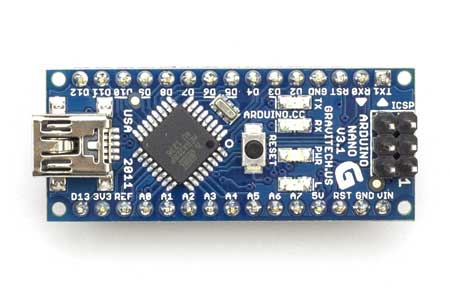

##De Arduino	

###Wat is een Arduino 

De Arduino (spreek uit als ardwieno) is een kleine computer waarmee je door signalen dingen kunt besturen. De Arduino kan signalen waarnemen zoals jij met je zintuigen (oren, neus, ogen) doet of signalen sturen (mond, handen). De Arduino kan met twee soorten electrische signalen werken; digitale signalen en analoge signalen. 

Digitale signalen kennen maar twee verschillende waarden, aan of uit, net zoals een lamp welke met de schakelaar wordt bediend. De lamp kan aan of uit. Voor deze waarden worden verschillende benamingen gebruikt. De waarde **aan** wordt ook wel eens ‘**1**’ of ‘**hoog**’ genoemd. Voor **uit** gebruikt men hier ook wel ‘**0**’ of ‘**laag**’. Op een Arduino zitten kleine rondjes of pinnetjes waarmee je deze signalen kunt versturen of ontvangen. Bij deze rondjes staat een D met een cijfer, D2, D3 etc.

Analoge signalen kennen veel verschillende waarden, deze gaan van laag naar hoog. Je kunt dit het beste vergelijken met een dimmer van een lamp waarmee je de lamp minder of meer fel kunt laten branden. Bij een dimmer heb je oneindig veel verschillende waarden, maar bij een arduino is dit beperkt. De laagste waarde is 0 en de hoogste waarde is 255. Je hebt dus 256 verschillende waarden! De kleine rondjes of pinnetjes met een A en een cijfer, A1, A2, etc. worden gebruikt voor analoge signalen.

##De Simulator

Een echt verkeerslicht werkt met een computer en zorgt ervoor dat bij een kruispunt iedereen deze veilig kan passeren. Iedereen krijgt op het juiste moment een signaal dat hij mag rijden of moet stoppen zodat er geen botsingen plaatsvinden als iedereen zich aan de regels van het verkeerslicht houdt.

Een verkeerslicht systeem bestaat uit drie belangrijke onderdelen; De centrale computer, een melder zodat de computer weet wanneer er iemand op het kruispunt aankomt en het verkeerslicht die met drie lampen aangeeft of iemand mag gaan rijden (groen), moet gaan stoppen als het kan (oranje) of moet wachten (rood).

De verkeerslicht simulator	bestaat ook uit deze drie onderdelen. De centrale computer (1) is een Arduino. Op deze computer worden de melders (2) en de lampen van de verkeerslichten aangesloten (3). 

Er zijn twee melders en twee verkeerslichten in de simulator. De melders zijn kleine schakelaartjes die aan of uit kunnen. Deze schakelaars heten "reed relais", dit spreek je uit als *riet relè*. Een melder maakt verbinding wanneer een magneetje in de buurt van de melder komt. Onder de auto's die bij de simulator horen zitten kleine magneetjes. Hierdoor maakt de melder verbinding als er een auto voor het stoplicht staat.

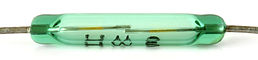

De melders en de lampen van de verkeerslichten worden aangesloten op een eigen aansluitpunt (poort) op de Arduino. De lampen en melders zijn aangesloten op de volgende punten op de Arduino

| Arduino  | Verbinding  | Straat |
|:------------- |:-------------------------- |:--------- |
|D2|Verkeerslicht Rood| 1st Street |
|D3|Verkeerslicht Oranje|1st Street |
|D4|Verkeerslicht Groen|1st Street |
|D5|Verkeerslicht Melder|1st Street |
|D6|Verkeerslicht Rood|2nd Street |
|D7|Verkeerslicht Oranje|2nd Street |
|D8|Verkeerslicht Groen|2nd Street |
|D9|Verkeerslicht Melder|2nd Street |

##Scratch

Om een computer te vertellen wat hij moet doen geef je hem opdrachten of instructies. Jij gaat dit voor het verkeerslicht doen in de programmeertaal Scratch 2.0. 

##mBlock

Met programma mBlock kun je programma's in Scratch schrijven en laten werken met een Arduino. Als je programma helemaal af is kun je deze op de Arduino zelf zetten en kan deze dan zonder de computer waarop je je programma aan het schrijven bent laten uitvoeren.

Voordat je verder gaat, zorg dan dat je mBlock geinstalleerd hebt. Je kunt mBlock downloaden op [http://www.mblock.cc](). Als je mBlock hebt geinstalleerd, sluit je computer dan met een USB kabel aan op de Arduino.

Als je mBlock voor de eerste keer opstart moet je een aantal instellingen in mBlock wijzigen.
Zet als eerste de **Arduino** extensie aan door in de menubalk onder ***Extensies*** de exensie ***Arduino*** te selecteren. Om de juiste instructies naar de Arduino te sturen moeten we aangeven welk type Arduino er is aangesloten op de computer. Kies in de menubalk onder ***boards*** voor de ***Arduino Nano (mega328)***.

Als laatste moet er aangegeven worden hoe de computer is aangesloten op de Arduino. Dit verschilt per computer en fabrikant van de Arduino. Het eenvoudigst om te bepalen op welke manier de Arduino is aangesloten is door de USB kabel uit de computer te verwijderen. Ga dan in het menubalk van mBlock naar ***Verbinden -> Seriële Poort*** poort en noteer welke poorten er getoond worden. Sluit nu de USB kabel aan op de computer en kijk nogmaals welke poorten er getoond worden. Als het juist is wordt er een extra poort getoond, kies deze poort om mBlock met de Arduino te verbinden. Iedere keer dat je de Arduino opnieuw op de computer aansluit zul je de poort opnieuw moeten verbinden. 

##Opdrachten

### Opdracht 1 je eerste programma

Als je mBlock hebt gestart zie je dat het programma verdeeld is in verschillende vlakken. Het vlak links bovenin waar de panda beer staat heet het *podium*. Op het podium wordt net zoals in het echt de uitvoering getoond. In mBlock wordt hier de uitvoering van het programma getoond. 

Het podium heeft nog geen achtergrond, je kunt een achtergrond kiezen door het ***nieuwe achtergrond icoon*** te selecteren en uit de lijst een nieuwe achtergrond toe te voegen. Op het podium staat Panda. Panda kun je vervangen door een ander figuur of je kunt meerdere figuren toevoegen. Onder het podium zie je de figuren die je geselecteerd hebt en iets op het podium kan laten doen. Wil je een nieuw figuur toevoegen, kies dan het ***nieuw figuur*** icoon boven lijst met figuren. Een figuur heet ook wel ***sprite***. Elk figuur kan ook een of meer kostuums hebben. Een kostuum is een andere vorm van het gekozen plaatje, dus het kunnen andere kleren zijn zoals in het echt maar ook een andere houding van een poppetje. Als je het tabje ***Kostuums*** kiest zie je welke kostuums er voor het plaatje gekozen kunnen worden. 

Net als in het theater wordt er op het podium een uitvoering gespeeld. Wat er wordt gespeeld staat in het script. In het script staat opgeschreven wie wanneer wat zegt en wat er gedaan moet worden. In mBlock kun je het tab scripts selecteren waarmee je kunt aangeven wat er gedaan, gezegd of afgespeeld moet worden. De taal waarin jij dit gaat doen heet Scratch. Door deze stukjes van het script achter elkaar te zetten krijg je een Scratch programma. 

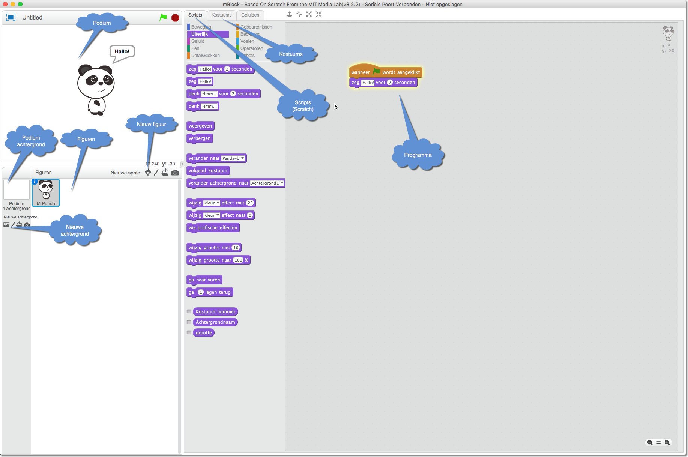

We gaan nu proberen een raket op te laten stijgen vanaf de maan! 

#### Het klaarzetten van het podium en de figuren

  1. Verwijder Panda, klik met de rechtermuisknop op Panda en kies ***verwijderen***
  2. Kies een nieuwe achtergrond, zoek de achtergrond ***moon***
  3. Kies een sprite, kies de sprite ***Spaceship***
  4. Als het figuur van de raket nu op het podium staat, zorg dan dat deze aan de onderkant van het podium staat. Net alsof hij op de maan geland is.
  5. De raket heeft nog een ander kostuum, kies dit andere kostuum zodat het landinggestel van de raket geopend is.

Als je dit allemaal goed hebt gedaan ziet het er nu ongeveer zo uit.

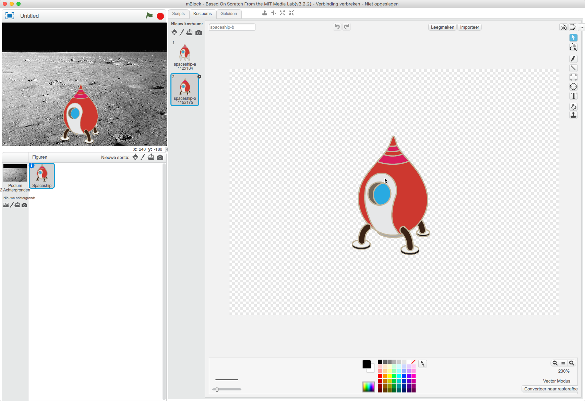

#### Het schrijven van het script (programma)

Het podium en het figuur zijn nu klaar, tijd voor het script ! Een script noemen we ook wel programma of computer programma. Hiermee vertellen we de computer wat hij moet doen. 

  1. Ga naar het tabje ***Scripts***
  2. Zoals je ziet zijn de scripts opgedeeld in verschillende groepjes. Ieder groepje heeft zijn eigen kleur. Je zult straks zien dat hier hierdoor makkelijker wordt om Scripts voor je programma te vinden. Kies nu de groep ***Gebeurtenissen***. Je ziet nu een aantal gebeurtenissen die je in je programma kunt zetten. Kies de gebeurtenis ***Wanneer (groen vlaggetje) wordt aangeklikt*** en sleep deze naar het programma gedeelte.	
3. We gaan de raket laten bewegen ! Ga naar de groep ***Beweging*** en sleep ***wijzig y naar 0*** naar het programma. Sleep dit onder het blokje ***Wanneer (groen vlaggetje) wordt aangeklikt*** zodat het als een puzzelstukje hieraan klikt.
4. In het nieuwe script dat je aan het programma hebt gevoegd staat een getal 0, verander dit getaal naar -85. Dit zorgt ervoor dat de raket bij het starten van het programma geland is.
5. Open nu groepje ***Bediening*** en sleep het script ***herhaal 10*** naar het programma. Plak dit weer onder het laatste stukje van het programma. In ***herhaal 10*** kun je op twee plekken een stukje script plakken. Onderaan en in het midden van ***herhaal 10***. Als je een script in het midden toevoegd zal dit straks meer keer herhaald worden. Evenveel keer als het getal dat in ***herhaal 10*** keer staat. Verander dit getal nu naar 15.
6. Ga weer naar het groepje beweging en sleep het script ***wijzig y met 10*** in het midden van ***herhaal 15***. Het script ***wijzig y met 10*** wordt dus straks 15 keer uitgevoerd.
7. Ga nu verder met wat je geleerd hebt totdat het programma er zo uit ziet als hieronder afgebeeld. Gebruikt de kleuren om het groepje te vinden waarin de scripts staan.  
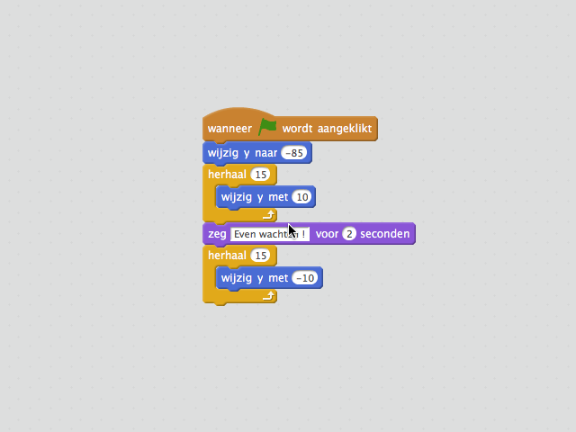
8. Klik nu met de muis op ***Wanneer (groen vlaggetje) wordt aangeklikt***. 

Jouw raket stijgt op en landt weer!

### Opdracht 2 variabelen gebruiken

Computerprogramma's maken gebruik laatjes waarin je iets in kunt stoppen. Je kunt er ook in kijken om te zien wat er in zit of er iets uithalen. Zo'n laatje noemen we een variabele. In een variabele kunnen je geen echte dingen stoppen maar een getal of tekst.

Je kunt in computerprogramma's ook beslissen of je iets wel of niet doet. Die beslissing noemen ze een conditie of voorwaarde. Bijvoorbeeld *als* je trek hebt *dan* ga je iets eten. Een computer kent alleen **waar** of **niet waar** voor een conditie. Dus in het voorbeeld heb je trek of geen trek, een computer kent niet *ik heb lekkere trek, in een Snicker*. Wat je gaat doen als een conditie waar is noem je de actie. Je kunt ook een conditie gebruiken met een variabele, bijvoorbeeld *als* de variabele de waarde *9* bevat *dan* gaan we iets doen. 

In deze opdracht ga je het spelletje 'raad het getal' schrijven. Het getal dat je moet raden wordt opgeslagen in een variabele, de variabele ***getal***.

1. Start een nieuw programma door het menu ***Bestand*** en dan ***Nieuw*** te kiezen.
2. Maak een variabele ***getal***. Ga naar ***Scripts*** en dan naar ***Data&Blokken***. Kies dan ***Maak een Variabele***. Maak een nieuwe variabele ***getal***.  Je hebt nu een variabele waarin je iets kunt bewaren.
3. Maak nu het programma zoals in het plaatje hier onder is afgebeeld.

Wat doet dit programma denk je ? Bij regel *05* verzint de computer een getal van 1 tot 10. Dit getal wordt in de variabele ***getal*** gezet. Je kunt nu de variabele gebruiken in een voorwaarde. Op regel *07* wordt de waarde in variabele ***getal*** vergeleken met de waarde in variabele ***Antwoord*** Het programma blijft een stukje herhalen totdat de waarde in variabele ***Antwoord*** gelijk is aan de waarde in variabele **getal**. Op regel *08* wordt om een getal gevraagd dat je moet invoeren. Dan volgt er op regel *09* weer een voorwaarde. Als het ingevoerde getal in de variabele ***Antwoord*** niet gelijk is aan het door de computer verzonnen getal zal het figuur zeggen dat het antwoord niet goed is. Dit gebeurt door de opdracht ***zeg*** op regel *10*.

Maar die laatste voorwaarde is wel een beetje vreemd, is het niet? Er staat ' *"niet" antwoord = getal* ' Wat betekent dit nu eigenlijk ? Als de computer in variabele ***getal*** "5" heeft gezet en ***Antwoord*** was "6". Dan is antwoord niet gelijk aan getal en is de voorwaarde dus "niet waar". Maar in de voorwaarde stond niet ' *Antwoord = getal* ' maar ' *"niet" Antwoord = getal* '. Er staat dus ' *"niet" niet waar* ', en dat is  *waar*. Dus als het Antwoord niet gelijk is aan getal is de voowaarde *waar*. Het gedeelte in het programma bij het gele balonnetje **4** zorgt er dus voor dat het programma iets zegt als *Antwoord* niet gelijk is aan *getal*.

Start het programma door op de Panda te klikken en probeer het uit. Je kunt altijd zien welk getal er in een variabele zit. Naast de Panda staan de variabelen en de waarde die daarin opgeslagen zit. Probeer hiermee eens in één keer het juiste getal te raden!

Probeer nu het programma aan te passen zodat je maar drie keer mag proberen om het getal te raden. Maak eerst een variabele ***pogingen*** en wijzig deze variabele naar 0. Zorg dan dat iedere keer als je een poging hebt gedaan er 1 bij de variabele ***pogingen*** wordt opgeteld (met één gewijzigd wordt). Als laatste moet je een conditie maken die zorgt dat het programma stopt, met ***stop alles***, als je meer dan drie keer een poging hebt gedaan om het getal te raden.

Lukt het echt niet ? Kijk dan bij de antwoorden!

### Opdracht 3 De Arduino programmeren

#### Initialiseren van de variabelen

Met mBlock kun je niet alleen programma's op je eigen computer schrijven. Je kunt ook programma's schrijven voor kleine computertjes welke ook in robots gebruikt worden, Arduino's. In deze opdracht ga jij je eerste programma maken en deze op de Arduino uitvoeren. 

Begin deze opdracht met het openen van het programma ***trafficlight_start.sb2***. Dit is de basis voor alle verkeerslicht programma's.

Het linker gedeelte van het programma wordt opgestart als het een signaal met de naam *initialize* ontvangt. Het stelt verschillende variabelen in, voor elke lamp en sensor één. Deze variabelen krijgen de waarde van de poort waarop de lamp of sensor is aangesloten. Hierdoor kun je variabelen gebruiken om een lamp aan of uit te zetten en hoef je niet elke keer te onthouden op welke poort de groene lamp van het stoplicht op 1st Street is aangesloten. Het tweede gedeelte van dit gedeelte van het programma gebruikt deze variabelen om de poorten laag (0) te maken. Dit zorgt ervoor dat als het programma start, alle lampen uit gaan.

Het rechter gedeelte van het programma is het startpunt van jouw programma. Het stuurt een *initialize* signaal zodat het linker gedeelte van het programma wordt gestart en wacht dan 2 seconden. Jouw eigen programma maak je door instructies na de *wacht 2 seconden* instructie toe te voegen.

#### Een knipperlicht maken

We beginnen eenvoudig door de groene lamp van het verkeerslicht op 1st te laten knipperen. 

* Sleep ***herhaal voor altijd*** onder de Scripts groep ***Bediening*** naar de onderzijde van ***wacht 2 seconden***
* Sleep nu ***stel digitale pin 9 output in als HOOG*** onder de Scripts groep ***Robots*** naar ***herhaal voor altijd***
* Onder ***Data&Blokken*** staat een variabele ***lamp_green_1st***. Sleep deze variabele over het witte rondje met de ***9*** in de instructie ***stel digitale pin 9 output in als HOOG***. Dit witte rondje geeft aan welke poort op de Arduino gewijzigd moet worden. Door een variable in dit witte rondje te slepen wordt de waarde in de variabele gebruikt om aan te geven welke poort gewijzigd moet worden. 
* Sleep ***wacht 1*** onder de Scripts groep ***Bediening***  onder de laatste toegevoegde instructie
* Klik nu met de rechtermuisknop op instructie ***stel digitale pin lamp_green_1st output in als HOOG***. Je krijgt nu een menu te zien dat bij de instructie hoort. Kies ***dupliceren***. Je hebt nu een kopie van de instructies ***stel digitale pin lamp_green_1st output in als HOOG*** en ***wacht 1 seconde***. Sleep de kopie van deze instructies onder de eerste instructie ***wacht 1 seconde***.
* Verander een van de twee instructies ***stel digitale pin lamp_green_1st output in als HOOG*** naar ***stel digitale pin lamp_green_1st output in als LAAG***

Als het goed is ziet je programma er nu ongeveer zo uit. Als dit klopt, start het programma dan door op ***Wanneer (groen vlaggetje) wordt aangeklikt*** te klikken. Als het allemaal goed gaat zal het groene licht van het verkeerslicht op 1st Street gaan knipperen. Lukt het niet, open dan het programma *task\_3\_1.sb2*

#### Een looplicht maken

Een looplicht is een rij van lampjes waarbij alle lampjes één voor één aan en uitgaan. Hierdoor lijkt het of het lampje vooruit loopt. Kun je nu proberen om van het verkeerslicht op *1st Street* de lampen één voor één aan en uit te laten gaan?

Ben je klaar? Probeer dan het programma te starten en kijk of het werkt.

Waarschijnlijk zul je een programma hebben gebouwd dat veel lijkt op het programma in hoofdstuk *Antwoorden, task\_3\_2.sb2 een eenvoudig looplicht*. Maar stel dat je in plaats van de lampen van één verkeerslicht alle lampen één voor één wilt laten branden. Dus niet alleen de lampen van de twee verkeerslichten maar ook de lampen van de sensors die in de weg zitten. Als je dit zou willen doen met het programma *task\_3\_2.sb2* dan zou het programma veel langer worden en moeilijker aan te passen. Dit moet toch slimmer kunnen ?!

#### Een langer looplicht

Je kunt programma om de lampen van het verkeerslicht op 1st Street één voor één aan en uit te laten gaan ook anders schrijven. Zoals het voorbeeld *task\_3\_3.sb2* zoals hieronder getoond. 

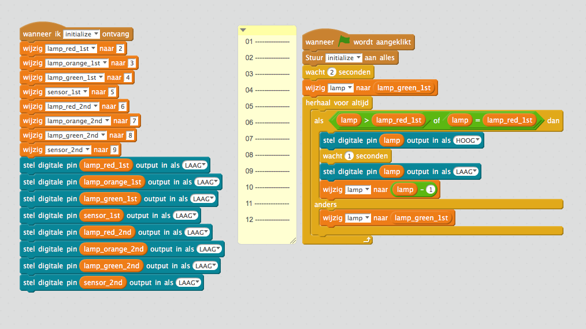

In het voorbeeld hierboven gebruiken we de variabele ***lamp***. We geven de variabele ***lamp*** op regel 04 dezelfde waarde als in variabele ***lamp\_green\_1st***. Dit noemt men ook welk *toekennen*, de waarde van ***lamp\_green\_1st*** wordt toegekend aan ***lamp***. De variabele ***lamp\_green\_1st*** heeft door het versturen van het bericht ***initialize*** de waarde "4" gekregen. De variabele ***lamp*** heeft dus op regel 4 nu ook de waarde "4" gekregen.

De instructie "herhaal voor altijd" op regel 05 en "als" op regel 06 slaan we even over, hier komen we later op terug. Op regel 07 stellen we een digitale pin in op hoog waardoor een led lampje dat op de digitale pin is aangesloten gaat branden. Welke digitale pin ingesteld wordt staat in variabele ***lamp***. Als het programma opstart gaat dus het led lampje aangesloten op digitale pin 4 branden omdat de variabele ***lamp*** de waarde "4" heeft. Dit is de groene lamp van het verkeerslicht op 1st street.

Op regel 08 wachten we een seconde waarna we op regel 09 dezelfde led lamp uitzetten door de output ***LAAG*** te maken. 
Op regel 10 gaan we de waarde van de variabele ***lamp*** aanpassen. We geven de variabele ***lamp*** de waarde van ***lamp*** min één. De variabele ***lamp*** verandert dus van 4 naar 3. De volgende keer dat regel 07, 08 en 09 door het programma gevolgd wordt staat er in de variabele ***lamp*** een andere waarde. Er gaat dan dus een ander led lampje aan en uit. Dit is het led lampje aangesloten op digitale poort 3, het oranje lampje van het verkeerslicht op 1st street. 

Elke keer nu dat regel 07 tot en met 10 worden aangeroepen wordt er een andere led lamp aan en uit gezet. Dit herhalen gebeurt door de instructie ***herhaal voor altijd*** op regel 05. Omdat bij iedere herhaling de waarde in variabele ***lamp*** met 1 wordt verlaagd wordt de waarde alleen maar kleiner. De rode lamp van verkeerslicht op 1st street heeft de laagste waarde van de digitale poorten. Dus als deze lamp door het programma is aan en uitgegaan zouden we willen dat er weer wordt begonnen met de eerste led lamp die we met het programma hebben laten knipperen.

Op regel 12 geven we de variabele ***lamp*** weer de waarde zoals deze bij het starten kreeg op regel 04. Maar alleen als er aan een voorwaarde wordt voldaan, als de waarde van ***lamp*** kleiner wordt dan de waarde van variabele ***lamp\_red\_1st***. De variabele ***lamp\_red\_1st*** heeft de laagste waarde van de digitale poorten waarop een led lamp is aangesloten. Deze voorwaarde staat op regel 06. Als de waarde van de variabele ***lamp*** groter of gelijk is aan de waarde in variabele ***lamp\_red\_1st*** wordt de lamp aan en uit gezet. Als niet aan deze voorwaarde wordt voldaan, wordt de waarde van ***lamp*** weer gelijkt gemaakt aan de waarde in variabele ***lamp\_red\_1st***.

Nu je een beetje weet hoe dit programma werkt kun je proberen om het programma een beetje aan te passen. Pas het programma zo aan dat alle led lampjes, dus ook de lampje van de sensors als één lang looplicht werken. Een tip, je hoeft maar 2 keer dezelfde wijziging te maken in het programma.

Lukt het niet, kijk dan bij voorbeeld *task\_3\_4.sb2 een langer looplichtt* in hoofdstuk *Antwoorden*.

### Opdracht 4 één verkeerslicht

In deze opdracht ga je één verkeerslicht helemaal werkend maken! Dit verkeerslicht moet altijd op rood staan, behalve als er een auto voor staat te wachten. Dan moet het verkeerslicht eerst op oranje om vervolgens naar groen te gaan. Na een tijdje moet het verkeerslicht weer via oranje naar rood verspringen. We beginnen met de sensor die kan zien of een auto voor het verkeerslicht staat. Laad het programma *task\_4\_1.sb2* en start het.

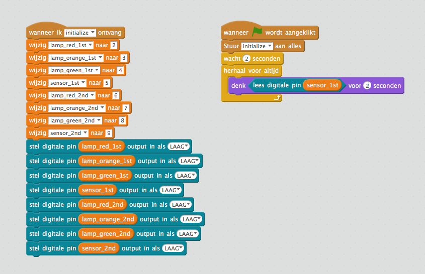

Zoals je ziet denkt de Panda de hele tijd aan '0'. Weet jij waarom hij de hele tijd aan '0' denkt ?

Het programma leest elke keer een digitale pin. Welke digitale pin dat is staat in variabele ***sensor_1st***. In variabele ***sensor_1st*** staat de waarde ***5***. Het programma leest dus de hele tijd de waarde van pin 5. De gelezen waarde wordt dan getoond door dit Panda te laten denken.

Laat nu een auto rijden tot aan het stoplicht van 1st Street totdat het groene lampje in de weg gaat branden. Het groene lampje in de weg laat zien dat de sensor ziet dat er een auto staat. Wat denkt Panda nu ?

De pin 5 op de Arduino is een digitale pin. Deze pin kent dus maar twee waarden! De pin is '0' als de sensor geen auto ziet, een '1' als hij wel een auto voor het verkeerslicht ziet.

Probeer nu de lichten van het verkeerslicht te laten verspringen als er een auto staat de wachten. Laat de lichten van rood naar geel en groen verspringen. Wacht dan even en laat dan de lichten weer in omgekeerde volgorde verspringen totdat het licht op rood staat.

Denk je dat het programma werkt, probeer het dan uit. Lukt het niet helemaal, probeer dan uit te zoeken wat er mis gaat. Door Panda te laten denken wat een waarde is of waar het programma is kun je er achter komen waar het misgaat. Een voorbeeld hoe je panda kunt laten denken welke waarde een variabele heeft of waar het programma is kun je hier onder zien. Dit zoeken naar fouten noemen we debuggen.

Je kunt in Scratch op nog een andere manier debuggen. Als je in naar ***data&blokken*** in het tabje ***scripts*** gaat zie je kleine vierkantjes naast de variabelen staan. Als je op het vierkantje klikt verschijnt er een vinkje, of gaat het vinkje weg als het er al stond. Variabelen waar een vinkje staat worden op het podium getoond met de waarde die op dat moment in de variabele zit. Zo kun je als je een programma probeert te debuggen altijd de waarde zien die in de variabele zit.

Lukt het echt niet om je verkeerslicht goed werkend te krijgen? Kijk dan eens bij de antwoorden van Opdracht 4.

### Opdracht 5 twee verkeerslichten die samenwerken

In deze opdracht moet je in plaats van één stoplicht, twee stoplichten laten werken. Dit lijkt na opdracht 4 niet zo moeilijk, maar op een kruispunt mogen nooit twee verkeerslichten gelijktijdig op groen staan. Probeer nu een programma te schrijven dat ervoor zorgt dat beide verkeerslichten werken. Als in elke straat een auto voor het verkeerslicht staat mag er maar één op groen springen. Het andere verkeerslicht mag pas op groen springen als het eerste verkeerslicht op rood staat. 

Ook hier is er niet één goed antwoord. Begin je programma eenvoudig en breid het stukje bij beetje uit. Als iets niet werkt zoals je verwacht had, probeer dan te debuggen zoals in opdracht 4.

Een antwoord met uitleg staat bij de antwoorden ***Opdracht 5, task\_5\_1.sb2 Voorbeeld 1****

# Antwoorden

## Opdracht 2 variabelen

Er is niet één juist antwoord, je kunt de oplossing op verschillende manieren bouwen. Hieronder zie je twee van de vele mogelijkheden.
Je kunt deze uitproberen door het programma *task_2_2.sb2* te laden en op een van de twee instructies **wanneer op deze sprite is geklikt** te klikken.

## Opdracht 3 De Arduino programmeren

### task\_3\_1.sb2 een eenvoudig knipperlicht

### task\_3\_2.sb2 een eenvoudig looplicht

### task\_3\_3.sb2 een eenvoudig verbeterd looplicht

### task\_3\_4.sb2 een langer looplicht

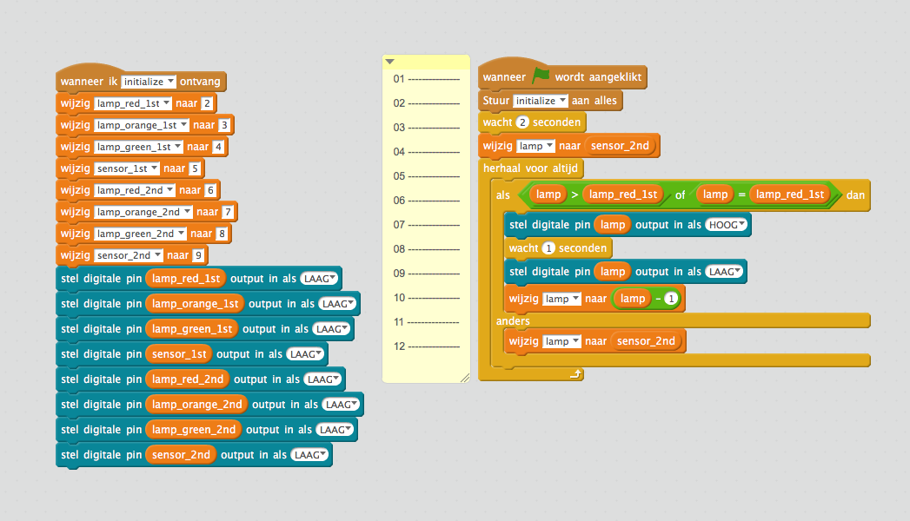

## Opdracht 4 één verkeerslicht

Er is niet één goede oplossing voor deze opdracht, er zijn er heel veel. Hier worden twee oplossingen getoond. 

### task\_4\_2.sb2 Voorbeeld 1

Omdat we alle programma's beginnen door het bericht ***initialize*** te sturen, gaan alle lichten uit. Dus we moeten hierna ervoor zorgen dat het rode licht brandt. Daarna wachten we tot de pin van de sensor een waarde '1' geeft.
Vervolgens wordt de rode lamp uit gezet en het gele licht aan. Na even gewacht te hebben wordt het gele licht gedoofd en gaat het groene licht aan. 
Omdat de variabele ***lamp*** dan gelijk is aan de waarde van ***lamp_green_1st*** is het eerste *herhaal tot:* blokje klaar en wacht het programma 2 seconden. Hierna zien we bijna dezelfde instructies die ervoor zorgen dan de lichten in omgekeerde volgorde gaan branden totdat het rode licht brandt.

### task\_4\_2.sb2 Voorbeeld 2

In voorbeeld 1 van opdracht 4 zit twee keer bijna dezelfde instructies. Ze doen bijna hetzelfde, en laten de lichten van het stoplicht een voor een branden. Het eerste ***herhaal tot:*** stuk laat de lichten van rood naar groen gaan, in het tweede ***herhaal tot:***  worden de lampen in de omgekeerder volgorde aan en uit gezet. 

Iemand die programmeert probeert te voorkomen dat hetzelfde stukje programma meer keren voor komt. Dit kan door slimmer te programmeren. Dit voorbeeld werkt hetzelfde als voorbeeld 1, alleen zorgt hetzelfde stuk programma ervoor dat de lichten van rood naar groen gaan en andersom. Er is een variabele ***getal*** gebruikt welke de waarde 1 bij de variabele getal opteld of er 1 vanaf haalt.

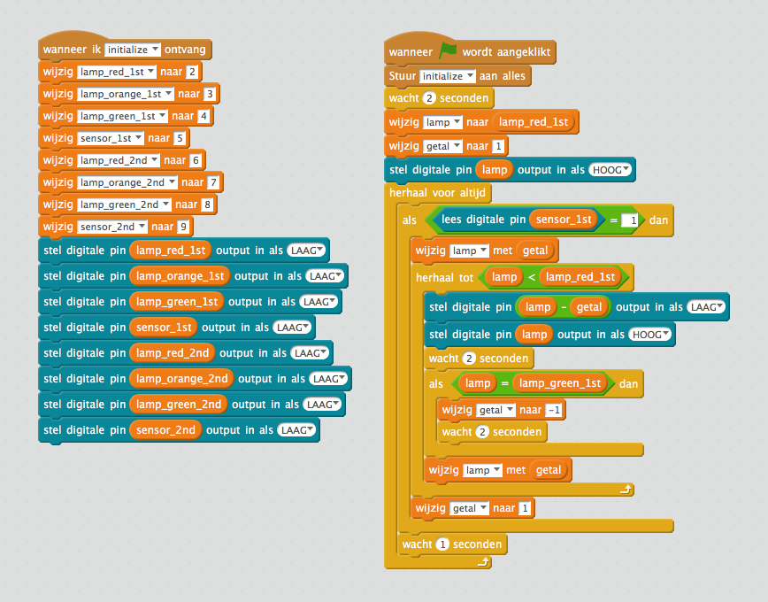

## Opdracht 5 twee verkeerslichten die samenwerken

### task\_5\_1.sb2 Voorbeeld 1

Dit is een voorbeeld van hoe je twee verkeerslichten samen kunt laten werken. Bij dit programma blijft een stoplicht ook langer op groen staan als er auto's langs het verkeerslicht blijven rijden. Dit is bijvoorbeeld handig als het verkeerslicht op een drukke straat staat. Dan hoeft het verkeerslicht niet steeds op groen te springen, maar blijft het even groen als er meerdere autos aan komen rijden.

Wat gebeurt er in dit programma ? Op de regels ***01*** en ***02*** worden beide verkeerslichten op rood gezet. Zo weten we altijd wat de beginstand is als we het programma starten. Het programma blijft zich altijd herhalen door de instructue ***herhaal voor altijd*** op regel ***03***. Op regel ***04*** zie je een instructie die we nog niet eerder gebruikt hebben, ***wacht tot***. Hier wordt gewacht totdat of ***sensor_1*** of ***sensor_2*** ***HOOG*** wordt. Als de volgende instructie wordt uitgevoerd weten we dat één van de twee sensors ***HOOG*** is. Daarom weten we dat als op regel ***05*** sensor_1 niet hoog is, sensor_2 hoog is. Op regel ***06*** en ***07*** zetten we de waarde van de sensor welke ***HOOG*** is in de variabele ***stoplicht***. De variabele ***lamp*** krijgt op regel ***08*** de waarde van variabele ***stoplicht***. De variabele ***lamp*** wordt verder in het programma gebruikt om aan te geven welk licht van een verkeerslicht brandt. Op regel ****09*** zie je weer een ***herhaal tot*** instructie. Deze instructie zorgt ervoor dat de instructies in ***herhaal tot*** zitten herhaald worden totdat het verkeerslicht weer op rood staat. 
Op regel ***10*** wordt de waarde van variabele ***lamp*** met één verlaagd. Als een auto voor het verkeerslicht van ***1st Street*** staat. Wordt de eerste keer dat dit in de ***herhaal tot*** gebeurt wordt de waarde van ***lamp*** gelijk aan de waarde van variabele ***stoplicht*** - 1, dus 4. Op poort ***D4*** van de arduino zit het groene licht van het verkeerslicht aangesloten. Op regel ***11***, ***12*** en ***13*** worden de lichten van het verkeerslicht uit gezet, het één van de lichten weer aan gezet. Zo brandt er altijd maar één licht op een verkeerslicht. Op regel ***15*** staat een ***als*** instructie, deze is waar als het groene licht van het verkeerslicht brandt. Regels ***16*** tot en met ***22*** zorgen ervoor dat het verkeerslicht langer op groen blijft staan als er autos het verkeerslicht blijven passeren. 
Op regel ***16*** krijgt de variabele ***teller*** de waarde 1. Op regel ***17*** staat weer een ***herhaal tot*** welke blijft herhalen totdat de waarde van variabele ***teller*** groter is dan 5. Met de instructie ***reset timer*** op regel ***18*** wordt er een klokje gestart. Dan wacht het programma op regel ***19*** weer tot het alarm van het klokje na 5 seconden afgaat of er weer een auto voorbij het verkeerslicht rijdt. Op regel ***20*** kijkt het programma of de reden dat het programma verder is gegaan omdat er een auto langs kwam òf dat het alarm was afgegaan. Als het alarm was afgegaan wordt er bij de variabele ***teller*** 3 opgeteld, anders 1. Door deze optelling zal de waarde van variabele ***teller*** op regel ***17*** sneller groter zijn dan 5 als er geen auto langs het verkeerslicht gaat. Als de variabele ***teller*** groter is dan 5 gaat het programma, na op regel ***23*** twee seconden te wachten, weer terug naar regel ***10***. Het verkeerslicht zal nu op oranje springen. Als het verkeerslicht op oranje of rood springt worden de regels ***15*** tot en met ***22*** niet meer uitgevoerd. Deze regels zorgen ervoor dat het licht dat brandt langer groen blijft, dit willen we alleen als het licht al op groen staat. 

# Geavanceerde opdracht

## De sensor

De melders van de verkeerslichten zijn aangesloten op poort 5 en 9 van de Arduino. Als het signaal niet duidelijk hoog (5 Volt) of laag (0 volt) wordt gemaakt zal bij het lezen een willekeurige waarde worden gelezen. Je kunt dit zien door het programma ***task\_A1\_PullUpDown.sb2*** te laden.

Op de arduino zit een aansluiting met het label ***GND***. Hier zitten 4 draadjes op aangesloten, twee van deze draden gaan naar het stoplicht op 1st. Street de andere twee naar 2nd. Street. Maak de twee draadjes welke naar 1st street gaan voorzichtig los van de Arduino.

Start nu het programma. Wat gebeurt er nu ? Je zult zien dat de pandabeer willeurig zal denken dat het Signaal LAAG of HOOG is. Dit komt omdat er overal om ons heen kleine electrische signaaltjes zijn welke worden opgevangen door het draadje dat van de melder naar aansluiting D5 op de arduino is aangesloten. Soms leest de Arduino deze kleine signaaltjes en denkt dan dat het signaal hoog is ook al is er geen auto boven de sensor. Als je de draadjes welke je net losgemaakt hebt weer vastmaakt zul je zien dat de pandabeer alleen maar denk dat het signaal LAAG is.

Hoe komt dit ? Kijk eens naar het onderstaande plaatje, dit noemen we een schema. Op het schema staat de arduino getekend als een blokje met alle aansluitpunten. Ook zie je hier het reed relais met het label ***S1*** en het led, ***LED1***. De symbooltjes ***R1*** en ***R2*** zijn weerstanden, deze zorgen electriciteit meer of minder door een draadje kan stromen. Het is moeilijk om je voor te stellen wat een weerstand precies doet, maar stel het electriciteitsdraadje eens voor als een tuinslang. Het water dat door de tuinslang loopt is de electriciteit. Als je nu in de tuinslang knijpt, gaat het water er minder hard door stromen. Hoe harder je knijpt, hoe hoger de weerstand, des te minder water stroomt er door de tuinslang. Met electriciteit is het precies hetzelfde, hoe groter de waarde van de weerstand des te moeilijker stroomt de electriciteit er door het draadje

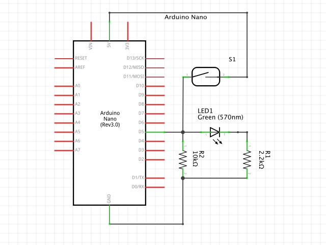

Op de onderstaande foto kun je zien waar de weerstanden, het ledje en reed relais in de weg zitten. Probeer deze componenten en de verbindingen te volgen en kijk of je deze in het schema kunt vinden.

Als er geen auto bij het stoplicht staat maakt het reed relais ***S1*** geen verbinding. Het signaal van 5 volt of het signaal HOOG komt niet aan bij poort ***D5*** omdat de schakelaar nog open staat.

Het draadje vanaf poort D5 is verbonden met een weerstand, de weerstand is weer verbonden met ***GND***. Deze weerstand noemen we een pull-down weerstand. Dit heet zo omdat de weerstand het signaal naar beneden trekt omdat deze is verbonden met ***GND***. De afkorting van ***GND*** komt van aarde en kun je vergelijken met de ***-*** op een batterij. Als je het weer vergelijkt met het voorbeeld met de tuinslang kun je ***GND*** vergelijken met het afvoerputje. Electriciteit stroomt dus van ***+*** naar ***-*** of ***GND***. Als er nu een klein signaaltje op het draadje van D5 komt, wordt deze afgevoerd naar ***GND***, zo blijft het signaal op D5 ***LAAG***.

Maar als de sensor nu wel een auto ziet, dan zou op ***D5*** toch ook het signaal op D5 ***LAAG*** zijn door de pull down weerstand ? Nee en dat zit zo; Als het reed relais verbinding maakt dan kan er veel stroom (een ***HOOG*** signaal) stromen van ***+*** (5 volt) naar ***GND***. Alleen zitten er op de weg naar ***GND*** nog twee weerstanden. Deze weerstanden zijn groot, er wordt dus hard op de tuinslang gedrukt, zodat de electriciteit niet zo makkelijk weg kan stromen. Hierdoor blijft het signaal voor de weerstanden ***HOOG***. Omdat de weerstand ***R2*** die tussen ***LED1*** en ***GND*** groter is stroomt de meeste electriciteit door ***LED1*** en gaat deze branden als er een auto op de sensor staat.

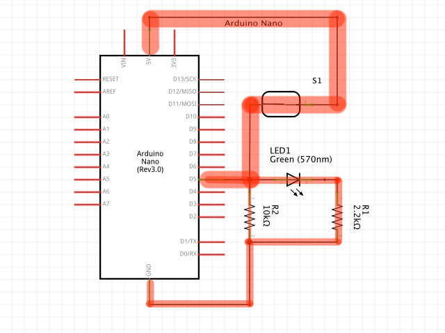

